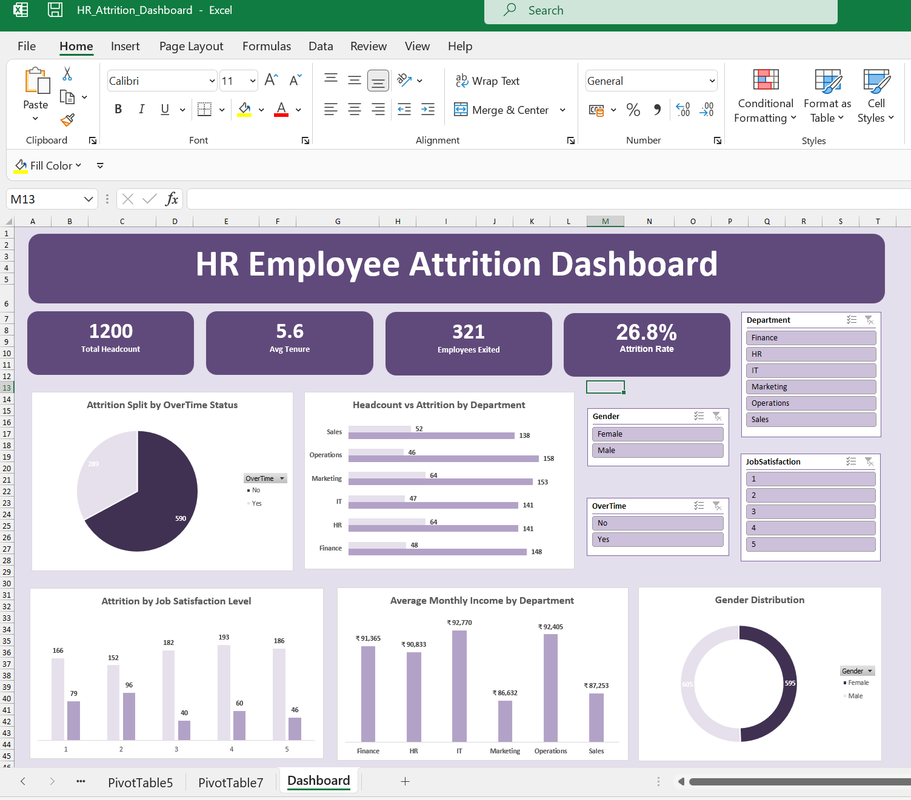

# HR Employee Attrition Dashboard | Excel

An interactive HR analytics dashboard built in Excel to analyze employee attrition patterns across departments, job satisfaction levels, overtime status, and compensation — using a mock dataset of 1,200 employee records.

## 📊 Project Overview

This project simulates a real-world HR analytics use case: identifying *why* employees leave and *where* attrition risk is concentrated, using only native Excel tools (no external BI software). The dashboard is fully interactive — slicers let you filter every chart and KPI simultaneously by Department, Gender, OverTime status, and Job Satisfaction level.

## 🎯 Key Insights

- **Overall attrition rate: 26.8%** (321 of 1,200 employees)
- **Average employee tenure: 5.6 years**
- Departments with the highest attrition: **HR (31.2%)** and **Marketing (29.5%)**
- Employees working overtime show a **meaningfully higher attrition rate** than those who don't
- Attrition is elevated at **low-to-moderate job satisfaction levels (1–2)** compared to higher satisfaction scores
- **IT and Operations** departments show the highest average monthly income; **Marketing** the lowest
- Gender distribution across the workforce: roughly **50/50 split** (605 Female, 595 Male)

## 🛠️ Tools & Techniques Used

- **PivotTables** — multiple tables summarizing attrition by Department, OverTime, Job Satisfaction, Gender, and Income
- **PivotCharts** — bar, pie, column, and doughnut charts, all slicer-connected
- **Slicers** — Department, Gender, OverTime, Job Satisfaction — filter all charts and KPIs together
- **GETPIVOTDATA** — used to link KPI cards directly to PivotTable values so they update dynamically with slicer selections
- **Formulas** — calculated columns for Tenure (from join/exit dates) and Flight Risk flagging
- **Conditional Formatting** — highlights high/medium flight-risk employees in the raw dataset
- **INDEX/MATCH & XLOOKUP** — employee-level lookup functionality

## 📁 Files in This Repository

| File | Description |
|------|-------------|
| `HR_Attrition_Dashboard.xlsx` | Full interactive Excel workbook with raw data, PivotTables, and dashboard |
| `dashboard_screenshot.png` | Static preview of the dashboard (default, unfiltered view) |

## 🔍 How to Explore

1. Download `HR_Attrition_Dashboard.xlsx` and open it in Excel (2016 or later recommended for full Slicer/PivotChart support)
2. Go to the **Dashboard** sheet
3. Use the slicers on the right to filter by Department, Gender, OverTime status, or Job Satisfaction level
4. Watch all KPI cards and charts update simultaneously
5. Explore the **RawData** sheet to see the underlying 1,200-record dataset and calculated columns (Tenure, Flight Risk)

## 📈 Dataset

Synthetic dataset of 1,200 employee records including Department, Job Role, Age, Gender, Marital Status, Date of Joining/Exit, Monthly Income, Performance Rating, Job Satisfaction, OverTime status, and Distance From Home — generated to reflect realistic HR attrition patterns for portfolio and analysis purposes.

---

**Built by:** Sandhya Marke
**Connect:** [LinkedIn](https://linkedin.com/in/sandhya-marke) | [GitHub](https://github.com/markesandhya)
